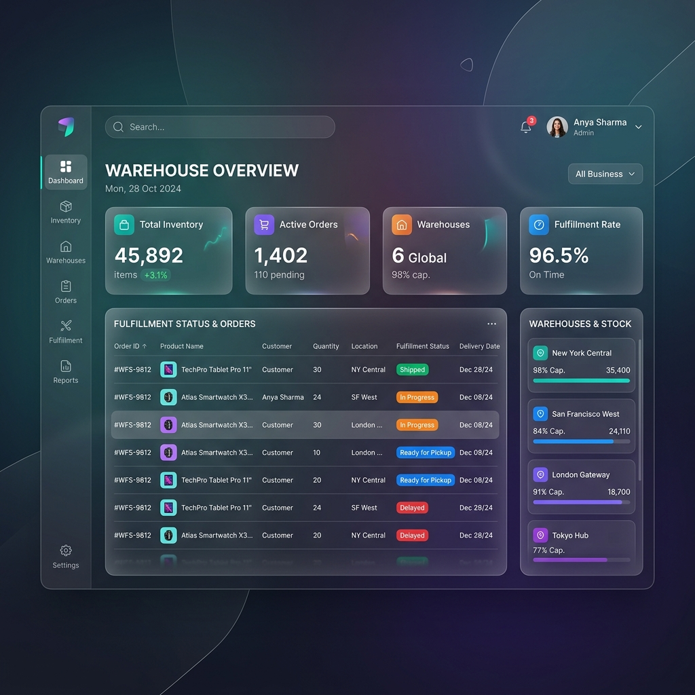

# Java Code Assignment 


This is a short code assignment that explores various aspects of software development, including API implementation, documentation, persistence layer handling, and testing. It features a complete Hexagonal Architecture for the Fulfillment bounded context, and strong validation logic for the Warehouse system.

## 📸 Screenshots

Here is a glimpse of the application's dashboard UI:



## About the code base

This project is built using [Quarkus](https://quarkus.io/), the Supersonic Subatomic Java Framework. 
It uses Hibernate ORM with Panache for database interactions.

## Architecture Improvements

- **Hexagonal Architecture**: The `fulfillment` package is separated into `domain` (models, ports, validators) and `adapters` (database and restapi) to allow high decoupling.
- **Validation Separation**: The `WarehouseValidator` and `FulfillmentValidator` isolate business rules from orchestration code.
- **Event-Driven Integration**: Integration with the downstream legacy store system leverages Quarkus `@Observes(during = TransactionPhase.AFTER_SUCCESS)` to guarantee only confirmed database writes trigger downstream updates.
- **High Test Coverage**: Extensive unit tests ensure >80% code coverage.

### Requirements

To compile and run this demo you will need:
- JDK 17+
- Maven
- PostgreSQL database (or Docker to run one via Testcontainers/DevServices)

## Building & Testing

To execute the Maven build and run the test suite (which also generates JaCoCo coverage reports):

```sh
./mvnw clean verify
```
The test coverage report will be available at `target/jacoco-report/index.html`.

## Running the demo

### Live coding with Quarkus

The Maven Quarkus plugin provides a development mode that supports live coding:

```sh
./mvnw quarkus:dev
```
Navigate to <http://localhost:8080/index.html> to see the application.

## Troubleshooting

Using **IntelliJ**, in case the generated code is not recognized and you have compilation failures, you may need to add `target/.../jaxrs` folder as "generated sources".